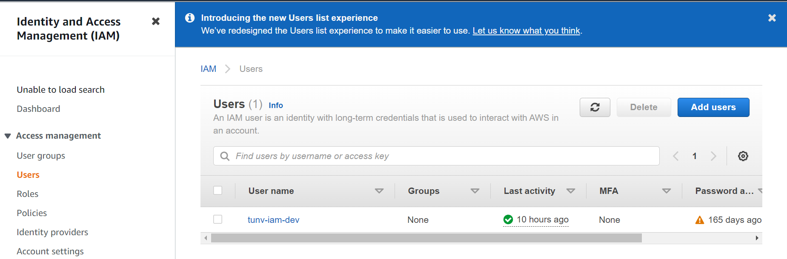
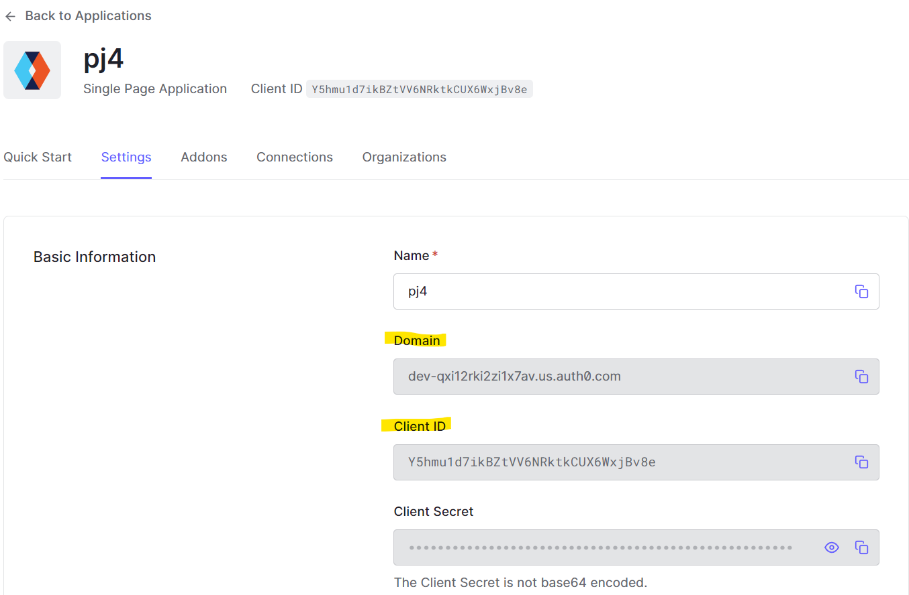

# Overview
Deploy a simple "TODO" application using AWS Lambda and Serverless framework. This application will allow users to create/remove/update/get TODO items
# Prerequisites
  - GitHub
  - Auth0 account : https://manage.auth0.com/
  - NodeJS v12.14 or greater up to v14.15 : https://nodejs.org/en/download/
  - AWS CLI v2 : https://docs.aws.amazon.com/cli/latest/userguide/install-cliv2.html
  - Serverless Account : https://dashboard.serverless.com/

# Instructions
## Login aws console -> create IAM user -> choose User -> choose tab "security_credentials" -> create access key " 
 
 
 

## Check and config aws

**1.Check aws cli working** 
- Type : aws --version 
 

## Install the Serverless Framework’s CLI and login

**1.Install Serverless** 
- Type command : npm install -g serverless@2.21.1
- Check install : serverless --version  
 

**2.Login and configure serverless to use the AWS credentials** 
- Login to your dashboard from the CLI. It will ask to open your browser and finish the process. 
- Type : serverless login 
 

- Config serverless use AWS credentials 
- Type : sls config credentials --provider aws --key YOUR_ACCESS_KEY_ID --secret YOUR_SECRET_KEY --profile NAME_PROFILE_YOUWANT 
 

- Type : cat ~/.aws/credentials  
- Success if you see "serverless" like this  
 

## Setup Backend server

**1. Clone project from github** 
**2. Move to folder backend** 
**3. Run command : npm install** 
**4. create an app on https://dashboard.serverless.com (just create it for the first time) - it should be the same as the app name in the serverless.yml config file** 
- You need change "org" in file serverless.yml by name account you created in Serverless dashboard 
- Change name "app" in file serverless.yml you want 
 
- Type command : serverless 
- follow step by step request - Select "Create 'NAME_APP' app in 'NAME_ACCOUNT' org" :  
 
- Create success and go to https://dashboard.serverless.com/ for check app created  
 
 
**5. Deploy server** 
- Type : serverless deploy --verbose 
- wait for the server to deploy 
 
**6. Go to AWS console -> CloudFormation**
- if you see this "UPDATE_COMPLETE", the deployment is done 
 

## Setup Frontend
**1. Login to the Auth0 portal, and navigate to your Dashboard** 
**2. Create a "Single Page Web Applications" type Auth0 application** 
 
**3. Go to the App settings, and setup the Allowed Callback URLs and Save** 
 
 
 
**4. Copy "domain" and "client id" to save in the /client/src/config.ts file and edit API endpoint** 
 
 
**5. Run Frontend**
- Move to folder /client
- Type : npm install  
- Type : npm start  
 
**6. Go to browser and check app running**
 

## Use App

**1. Login**
 
 
**2. Create Newtask** 
 
**3. Update task (image, process)** 
 
 
 
 
**4. Delete task** 
 
 

## Check Log app

- Go to AWS -> CloudWatch -> Log Group 
 
 

